# 🦷 SmileCare Dental

A premium, fully responsive dental clinic website designed for modern healthcare providers, private dental practices, and multi-specialty clinics. Built with Next.js, TypeScript, Tailwind CSS, and Framer Motion, the website delivers a clean, trustworthy, and professional user experience with online appointment booking, service showcases, expert dentist profiles, and elegant animations.

🔗 **Live Demo:** https://smile-caree-dental.vercel.app

---

# 📖 About the Project

SmileCare Dental is a premium healthcare website created to help modern dental clinics establish a strong online presence while providing patients with a seamless digital experience.

The website features comprehensive service pages, professional dentist profiles, online appointment booking, patient testimonials, modern UI animations, and responsive layouts optimized for all devices.

This project demonstrates advanced frontend development, responsive UI design, component-based architecture, accessibility, and production-ready web development practices.

---

# ✨ Features

### 🏥 Clinic Experience

- Premium landing page
- Modern healthcare design
- Professional branding
- Animated hero section
- Call-to-action buttons

### 🦷 Dental Services

- Teeth Cleaning
- Teeth Whitening
- Dental Implants
- Root Canal Treatment
- Orthodontics
- Pediatric Dentistry
- Smile Makeover
- Cosmetic Dentistry

### 👨‍⚕️ Expert Dentists

- Professional dentist profiles
- Qualifications
- Experience
- Specializations
- Social media links

### 📅 Appointment Booking

- Online appointment form
- Date & time selection
- Doctor selection
- Treatment selection
- Form validation

### 😊 Patient Testimonials

- Customer reviews
- Star ratings
- Success stories
- Professional testimonial cards

### 🖼 Smile Gallery

- Before & After showcase
- Modern gallery layout
- Responsive image grid
- Hover animations

### 🏥 Clinic Facilities

- Digital X-Ray
- Emergency Dental Care
- Advanced Equipment
- Sterilization Systems
- Comfortable Waiting Area

### 📞 Contact

- Contact form
- Google Maps integration
- Business information
- Working hours
- Emergency contact

### 🎨 User Experience

- Fully responsive
- Mobile-first design
- Smooth animations
- Elegant transitions
- Premium UI
- Modern typography

### 🚀 Performance

- SEO optimized
- Fast loading
- Optimized images
- Accessibility focused
- Reusable components

---

# 🛠 Tech Stack

## Frontend

- Next.js
- React
- TypeScript
- Tailwind CSS
- Framer Motion
- Lucide React

## UI & Styling

- Responsive Design
- Modern UI/UX
- CSS Grid
- Flexbox
- Glassmorphism
- Smooth Animations

## Deployment

- Vercel

---

# 📸 Screenshots

### 🏠 Home & About

| Home | About |
|------|-------|
| 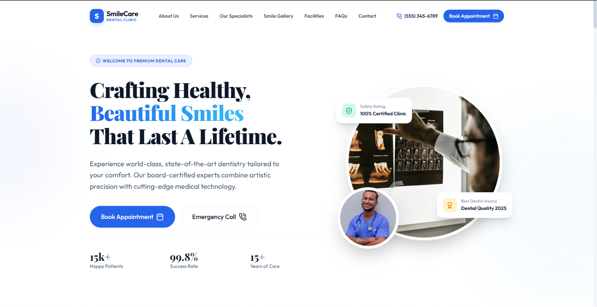 | 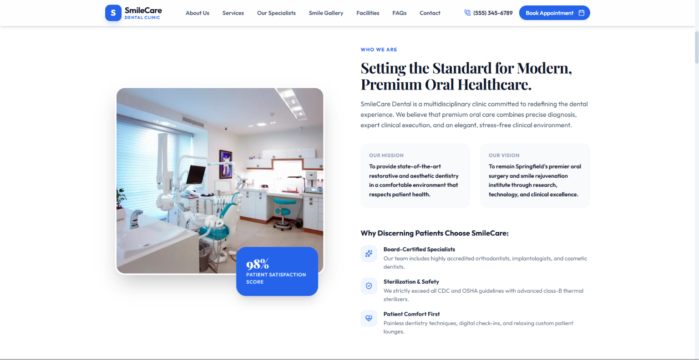 |

---

### 🦷 Services & Our Specialists

| Services | Our Specialists |
|----------|-----------------|
| 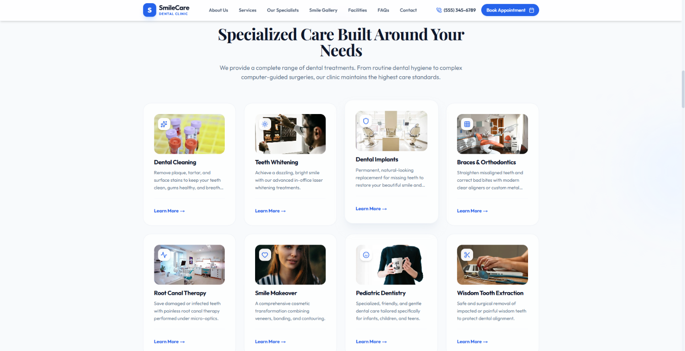 | 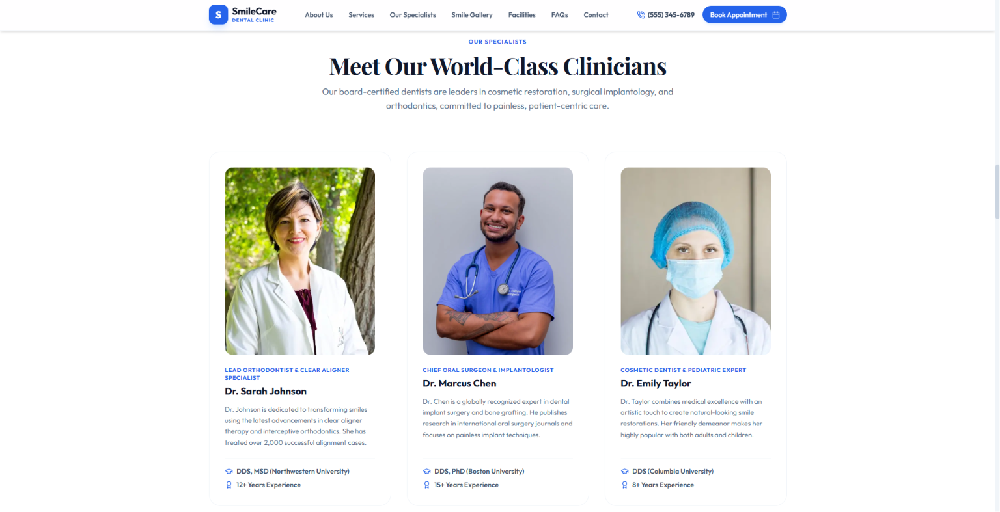 |

---

### ✨ Smile Gallery & Testimonials

| Smile Gallery | Testimonials |
|---------------|--------------|
| 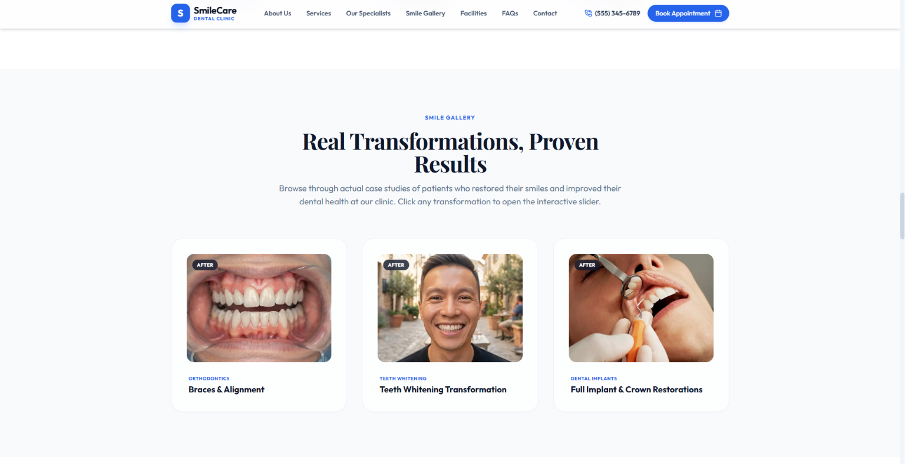 | 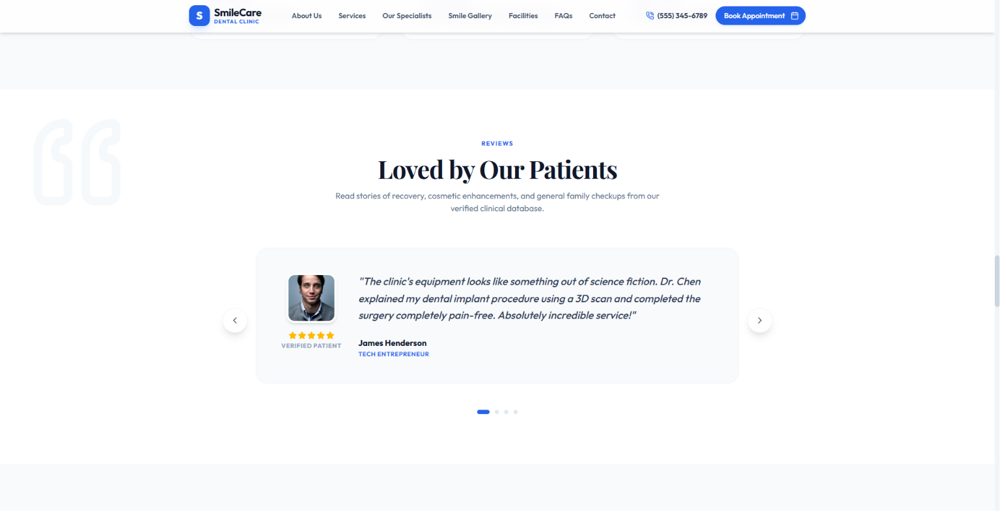 |

---

### 📅 Appointment & Facilities

| Book Appointment | Facilities |
|------------------|------------|
| 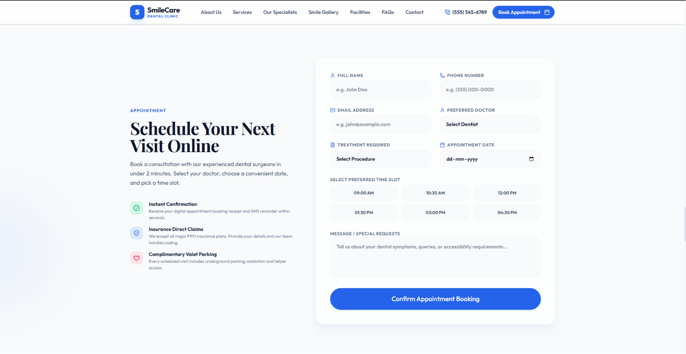 | 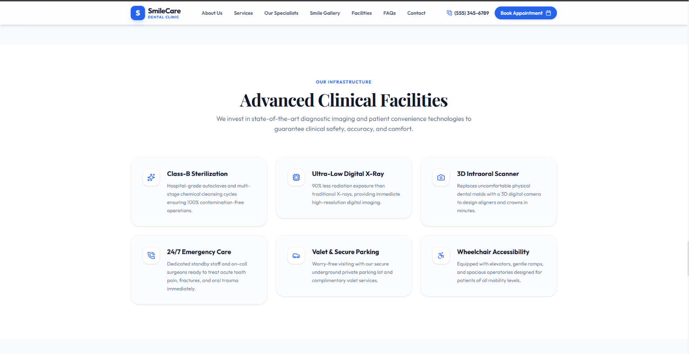 |

---

### ❓ FAQ & Contact

| FAQ | Contact |
|-----|---------|
| 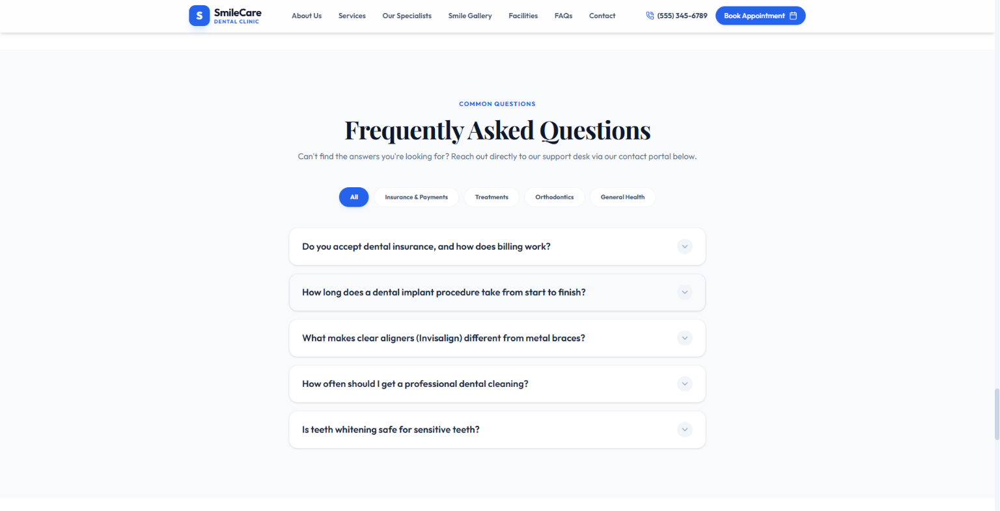 | 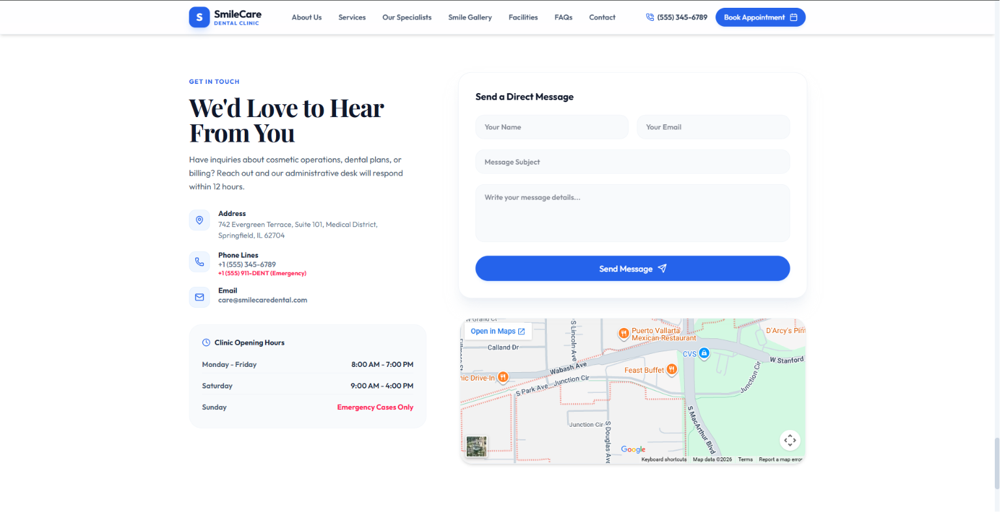 |

---

### 📱 Mobile Preview

<p align="center">
  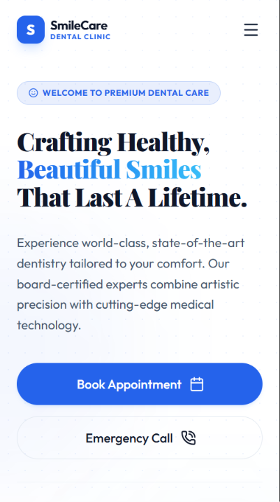
</p>

---
---

# 📂 Project Structure

```text
smilecare-dental
│
├── public
│   ├── images
│   └── icons
│
├── src
│   ├── app
│   ├── components
│   ├── data
│   ├── hooks
│   ├── lib
│   ├── styles
│   └── types
│
├── screenshots
│
├── package.json
├── tsconfig.json
└── README.md
```

---

# ⚙️ Installation

## Clone the repository

```bash
git clone https://github.com/larrymargerum01/smilecare-dental.git
```

## Navigate into the project

```bash
cd smilecare-dental
```

## Install dependencies

```bash
npm install
```

---

# ▶️ Running the Project

```bash
npm run dev
```

Runs on

```text
http://localhost:3000
```

---

# 🌍 Live Deployment

**Live Website**

https://smile-caree-dental.vercel.app

---

# 💡 What I Learned

While building this project, I learned:

- Building production-ready healthcare websites
- Next.js App Router
- TypeScript best practices
- Responsive web development
- Modern UI/UX principles
- Component-based architecture
- Framer Motion animations
- Performance optimization
- SEO fundamentals
- Accessibility improvements
- Git & GitHub workflow
- Deployment with Vercel

---

# 🚀 Future Improvements

- Patient Portal
- Online Payment Integration
- Appointment Management Dashboard
- Email & SMS Notifications
- Multi-language Support
- Doctor Availability Calendar
- Live Chat Support
- Medical Blog
- Patient History Dashboard
- AI-powered Appointment Assistant

---

# 👨‍💻 Author

**Larry Margerum**

Full Stack Developer

**GitHub**  
https://github.com/larrymargerum01

---

# ⭐ Support

If you found this project helpful, consider giving it a ⭐ on GitHub.

It motivates me to continue building high-quality projects.
